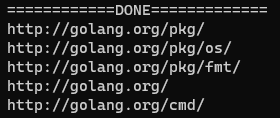

# Web Crawler
 Implementing a parallelized web crawler in Go

<br>

Crawling using channels           |  Crawling using classic locks
:-------------------------:|:-------------------------:
  |  


<br>

## 😎 **Quick start**

<br>

First, [download](https://go.dev/dl/) and install **Go**.

Next, make sure you are in the directory of one of the two methods, `parallel_web_crawler_using_channels` or `parallel_web_crawler_using_classic_locks`.

## Then just run the following:

<br>

To crawl using channels           |  To crawl using classic locks
:-------------------------:|:-------------------------:
run --> `crawler_channels_implementation.go`  |  run --> `crawler_locks_implementation.go`

---
<br>

## using the following commands:

<br>

```bash
go run crawler_channels_implementation.go
```
## or
```bash
go run crawler_locks_implementation.go
```
<br>

## That's all you need to know to start! ✅

<br>

---

<br>

## Note
### I have used a fake fetcher, that implements a simplified version of the `golang.org` website, but it would also work if used with the real web given the right conditions/setup.

<br>

---

<br>

##  ⚒️ **Built with**

<br>


- [Go](https://go.dev/) - Go is an open source programming language supported by Google. Used to build fast, reliable, and efficient software at scale.

<br>


## 🚩 [License](https://github.com/mostafa-aboelnaga/Web-Crawler/blob/main/LICENSE)

MIT © [Mostafa Aboelnaga](https://github.com/mostafa-aboelnaga/)


